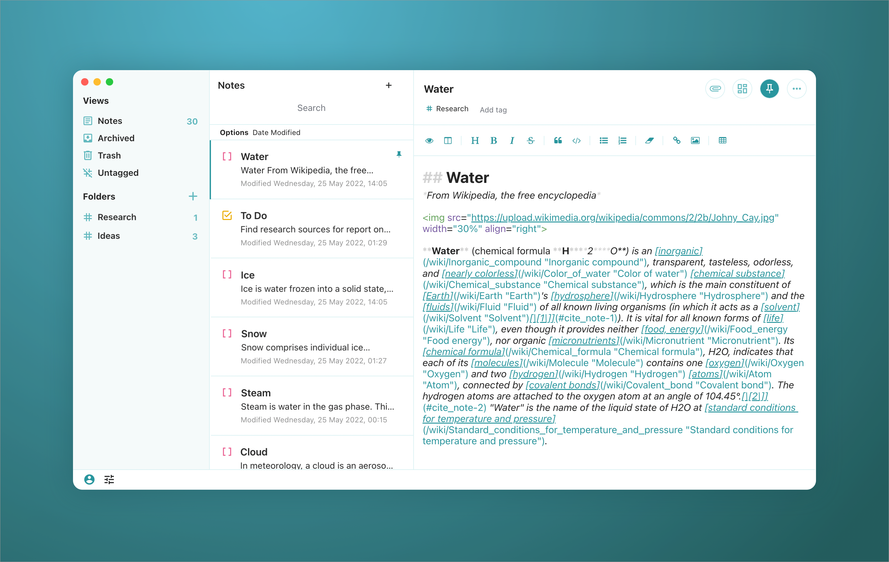

# Aqua Light theme for Standard Notes

A light teal and white theme for Standard Notes.



## Installation

### Installing the theme

1. In Standard Notes, click the slider icon in the lower left corner.
2. Click "Open Preferences" in the menu.
3. In the left sidebar, click the "General" tab.
4. Scroll to the bottom of the page and click "Advanced Settings" to expand the options.
5. Scroll to the "Install Custom Extension" section at the bottom.
6. Enter this URL in the field and click "Install".
````https://cdn.jsdelivr.net/gh/sandraor/sn-aqua-light-theme@main/ext.json````

### Using the theme

1. In Standard Notes, click the slider icon in the lower left corner.
2. Click "Themes" in the menu and select "Aqua Light" to switch to the theme.